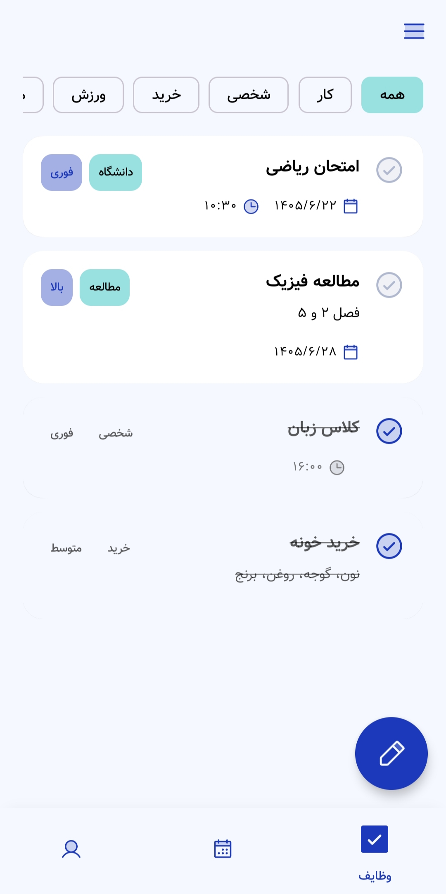
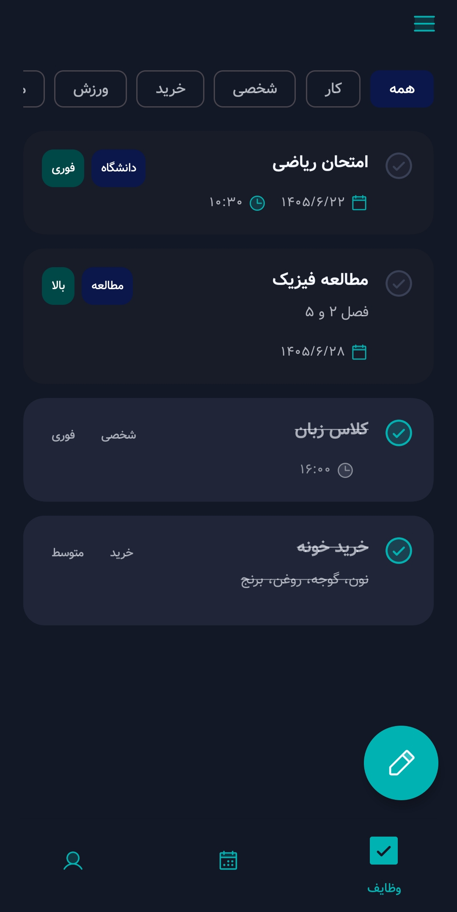
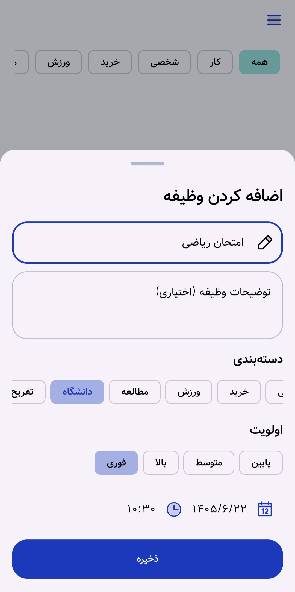
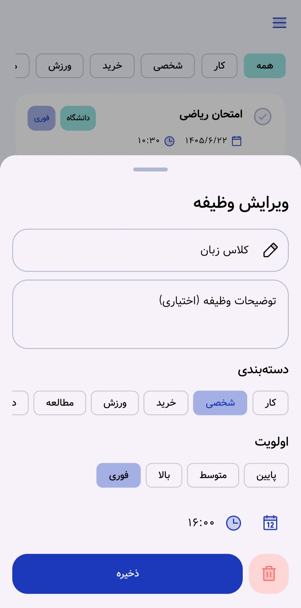
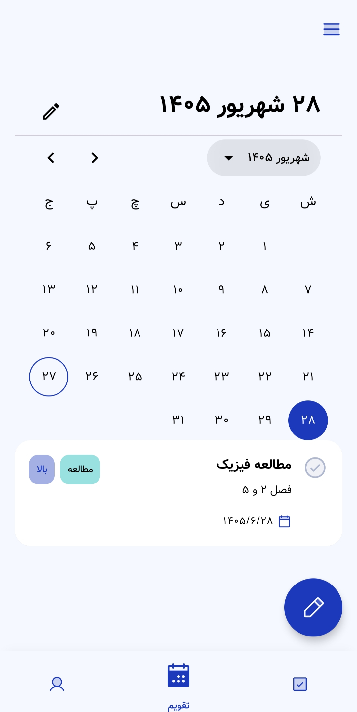
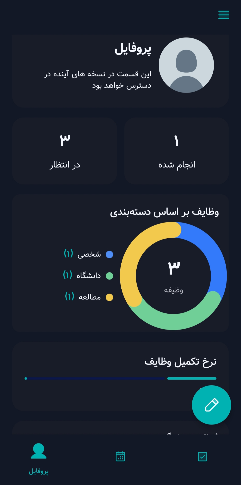
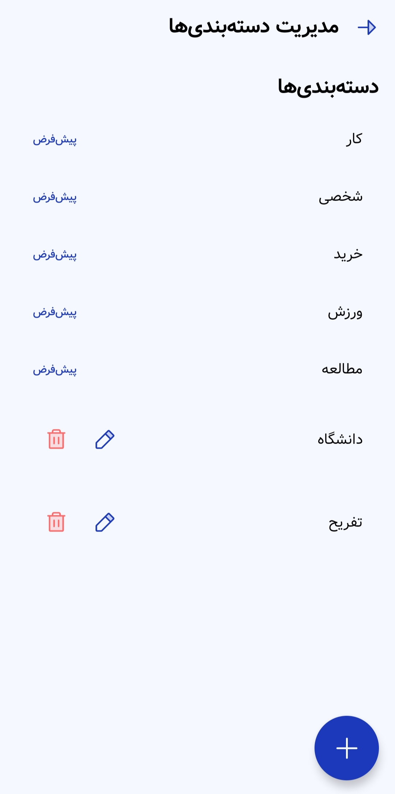
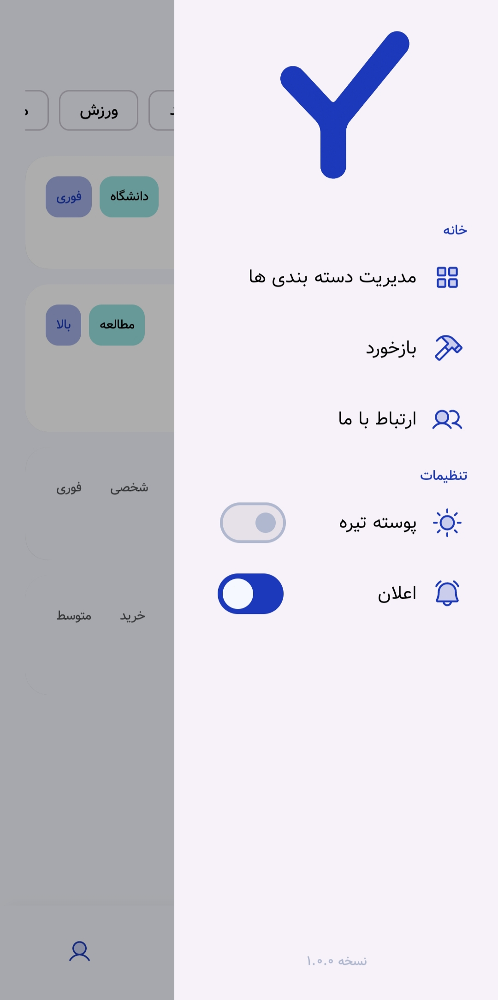
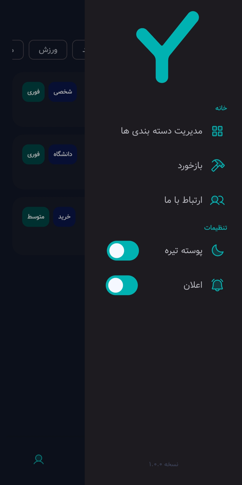

# To Do Yar

**To Do Yar (تودویار)** is a modern Android task management application designed to help users organize tasks, manage priorities and categories, set reminders, and track their daily activity.

The application is built with **Kotlin** and **Jetpack Compose**, following the **MVVM architecture** and modern Android development practices. It uses **Room**, **DataStore**, **Dagger Hilt**, **Coroutines**, **Flow**, and **WorkManager** to provide a maintainable and responsive application architecture.

---

## 📱 About the Project

To Do Yar is a task management application developed to provide a simple and modern way to organize daily activities and tasks.

Users can:

* Create, edit, and delete tasks
* Mark tasks as completed
* Assign categories to tasks
* Set task priorities
* Set due dates and times
* Receive task reminders
* Filter tasks by category and priority
* View tasks based on selected dates
* Track weekly task activity
* View task statistics and activity information
* Manage application appearance with light and dark themes

The application stores task data locally, allowing the core task management features to work without requiring a remote backend.

---

## ✨ Features

### 📝 Task Management

* Create new tasks
* Edit existing tasks
* Delete tasks
* Mark tasks as completed
* Track completion time
* Add optional descriptions
* Assign categories and priorities

### 🏷 Categories

Tasks can be organized using categories such as:

* Work
* Personal
* Shopping
* Exercise
* Study

Users can also create and remove custom categories.

### 🔔 Reminders

To Do Yar uses Android background scheduling to provide task reminders even when the application is not actively open.

The reminder system is based on **WorkManager** and Android notifications.

### 📊 Activity & Statistics

The application provides information about task activity, including:

* Completed tasks
* Pending tasks
* Weekly activity
* Task statistics

### 🌓 Theme

The application supports:

* Light theme
* Dark theme

The selected theme is persisted locally using **DataStore**.

---

## 🛠 Tech Stack

| Technology          | Usage                              |
| ------------------- | ---------------------------------- |
| **Kotlin**          | Primary programming language       |
| **Jetpack Compose** | Declarative UI                     |
| **Material 3**      | UI components and theming          |
| **MVVM**            | Application architecture           |
| **Dagger Hilt**     | Dependency injection               |
| **Room**            | Local database                     |
| **DataStore**       | Persistent application preferences |
| **Coroutines**      | Asynchronous programming           |
| **Flow**            | Reactive data streams              |
| **WorkManager**     | Background task scheduling         |
| **Navigation**      | Screen navigation                  |

---

## 📐 Architecture

To Do Yar follows the **MVVM (Model–View–ViewModel)** architecture pattern.

The main application flow can be summarized as:

```text
UI
 ↓
ViewModel
 ↓
Repository
 ↓
Room / DataStore
```

Background task reminders are handled separately using **WorkManager** and Android notifications.

This architecture helps keep the UI layer independent from data sources and makes the application easier to maintain and extend.

---

## 📸 Screenshots

Here are some screenshots of the To Do Yar application.

### 📝 Task Management

| Task List - Light | Task List - Dark |
| :---: | :---: |
|  |  |

| New Task | Edit Task |
| :---: | :---: |
|  |  |

### 📅 Calendar & Profile

| Calendar | Profile |
| :---: | :---: |
|  |  |

### 🏷️ Categories

| Categories |
| :---: |
|  |

### 📂 Navigation Drawer

| Light Theme | Dark Theme |
| :---: | :---: |
|  |  |

---

## 📦 APK

The latest release of **To Do Yar** is available on GitHub Releases.

**[⬇️ Download To Do Yar v1.0.0](https://github.com/AmirMoNasiri/ToDoYar/releases/tag/v1.0.0)**

  <a href="https://myket.ir/YOUR_APP_LINK">
    
  </a>
  <br><br>
  <a href="https://cafebazaar.ir/app/com.amirmonasiri.todoyar">
    
  </a>

The APK can be installed directly on a compatible Android device for testing.

---

## 📄 Documentation

The complete project documentation and final project report are provided separately.

The documentation covers:

* Project requirements
* Application architecture
* Database design
* UI design
* Implementation details
* Testing
* Final results

---

## 🎓 Academic Project

To Do Yar was developed as a **Bachelor's degree project**.

**Developer:** Amir Mohammad Nasiri
**Supervisor:** Dr. Morteza Yousef Sanati

---

## 📌 Project Status

**Version 1.0.0** represents the final release of the To Do Yar project.

---

## 👨‍💻 Author

**Amir Mohammad Nasiri**

Android Developer
Kotlin • Jetpack Compose • MVVM • Room • Hilt

---

⭐ If you find this project useful, consider giving it a star.
